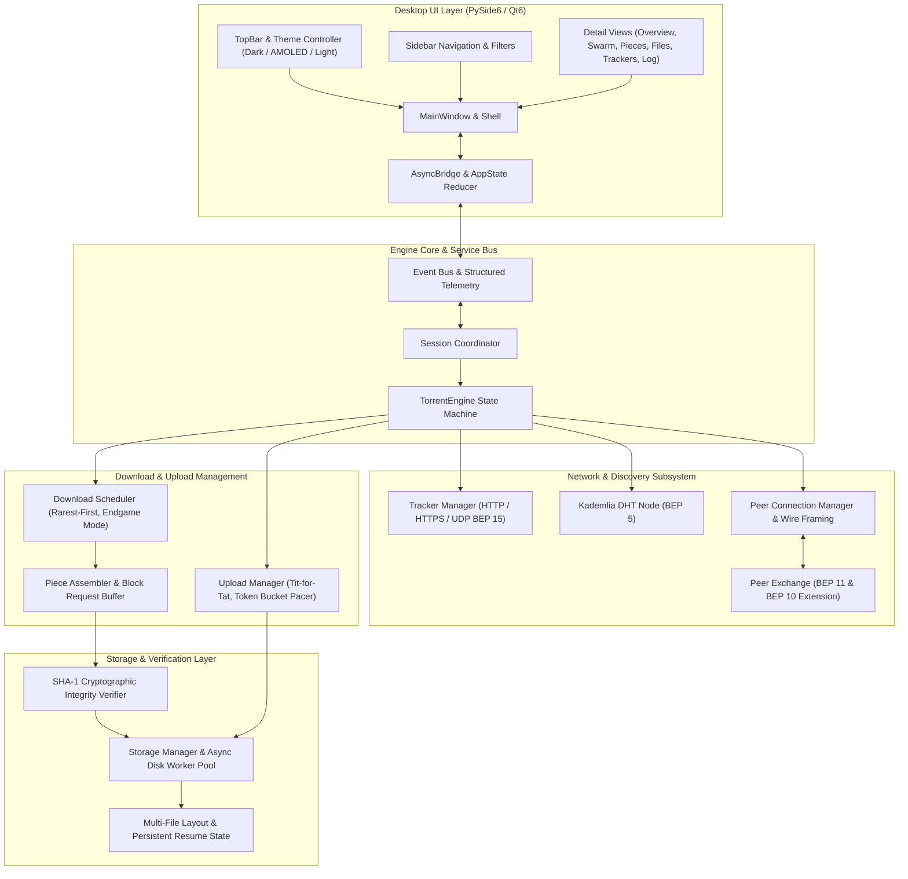
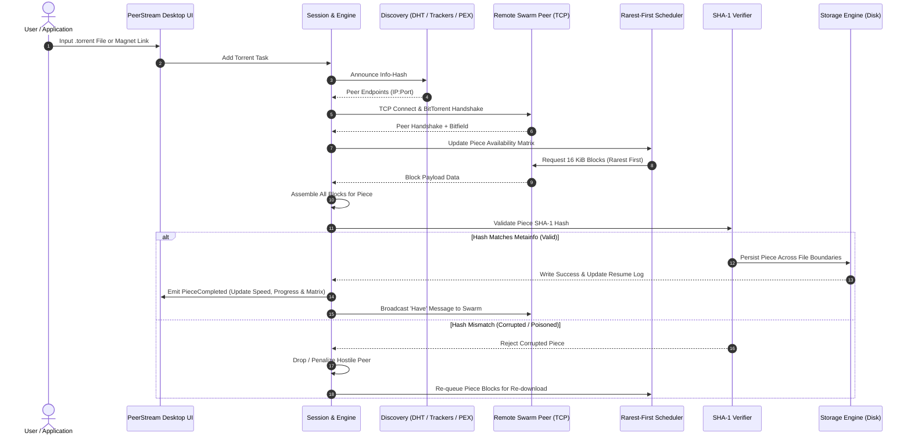

<div align="center">

# 🌊 PeerStream

### High-Performance, Next-Generation BitTorrent Desktop Client & Engine

[](https://www.python.org/)
[](https://doc.qt.io/qtforpython/)
[](https://docs.python.org/3/library/asyncio.html)
[](LICENSE)
[](https://mypy-lang.org/)
[](https://github.com/astral-sh/ruff)
[]()
[]()

<p align="center">
  <b>A fully featured, protocol-compliant BitTorrent client written from scratch in Python.</b><br/>
  Real sockets • Real swarm wire protocols • Zero simulation • Reactive modern desktop UI
</p>

[Key Features](#-key-features) •
[System Architecture](#-system-architecture) •
[Download Pipeline](#-download--verification-pipeline) •
[Specifications & BEPs](#-specifications--beps-implemented) •
[Getting Started](#-getting-started) •
[CLI Usage](#-cli-usage) •
[UI & Theming](#-ui--theming) •
[Testing & Verification](#-testing--code-quality)

---

</div>

## 📖 Overview

**PeerStream** is a high-performance, asynchronous BitTorrent client and network visualizer designed to **make the invisible network visible**. Unlike wrapper libraries or partial mock clients, PeerStream implements every protocol layer from scratch: custom Bencode serialization, TCP wire protocols, tracker communication (HTTP/S and UDP), Kademlia DHT node discovery, Peer Exchange (PEX), rarest-first piece scheduling, token-bucket rate limiting, SHA-1 cryptographic integrity checks, and resumable sparse multi-file disk allocation.

## Installation

### Windows

Download the latest PeerStream installer from the [Releases](../../releases/latest) page.

1. Download `PeerStream-Setup-1.0.0.exe`
2. Run the installer
3. Follow the setup wizard
4. Launch PeerStream from the Start Menu or Desktop

No Python installation is required.

## System Requirements

- Windows 10 or later
- x64 architecture
- Internet connection for torrent networking

---

## ✨ Key Features

- **⚡ Asynchronous Core Engine**
  - Native `asyncio` event-driven foundation with dedicated background thread pools for non-blocking disk I/O and SHA-1 piece hashing.
  - Fine-grained token bucket bandwidth pacer for smooth rate limiting without socket starvation.

- **🌐 Multi-Tiered Swarm Discovery**
  - **Trackers:** HTTP, HTTPS, and binary UDP trackers ([BEP 15](https://www.bittorrent.org/beps/bep_0015.html)) with multi-tier failover and backoff.
  - **Kademlia DHT:** Decentralized node discovery ([BEP 5](https://www.bittorrent.org/beps/bep_0005.html)) with automated 15-minute `announce_peer` cycles.
  - **Peer Exchange (PEX):** Real-time swarm contact gossip ([BEP 11](https://www.bittorrent.org/beps/bep_0011.html)) negotiated over BEP 10 extension protocol.
  - **Magnet Links:** Instant metadata resolution and handshake negotiation ([BEP 9](https://www.bittorrent.org/beps/bep_0009.html)).
  - **Private Swarm Respect:** Full adherence to [BEP 27](https://www.bittorrent.org/beps/bep_0027.html) (private flags disable DHT and PEX automatically).

- **🛡️ Secure Storage & Integrity Verification**
  - Strict pre-write SHA-1 cryptographic piece verification to eliminate bad blocks and poisoned peers.
  - Multi-file mapping with boundary-crossing piece support.
  - Crash-resilient resume state cache allowing immediate session recovery without redundant re-downloads.

- **🎨 Next-Generation PySide6 Interface**
  - **Dynamic Theming:** Seamless on-the-fly toggling between **Dark Mode**, **AMOLED Pure Black**, and **Light Mode**.
  - **Real-Time Telemetry:** Live swarm connection graphs, transfer rate charts, piece availability heatmaps, and detailed peer state tables.
  - **WCAG 2.1 AA Compliant:** Contrast-tested surfaces and fully accessible Qt accessibility tree.
  - **Zero Socket Blocking:** PySide6 UI and the AsyncIO engine interact exclusively via a thread-safe message bridge.

- **🖥️ Dual Interface: GUI & Headless CLI**
  - Full-featured command line tool for metadata inspection, tracker polling, swarm debugging, and headless downloading.

---

## 🏛️ System Architecture

PeerStream enforces strict unidirectional state flow and total decoupling between the network/protocol engine and the user interface.



---

## 🔄 Download & Verification Pipeline

Every downloaded byte travels through strict validation boundaries before reaching your storage drive:



---

## 📜 Specifications & BEPs Implemented

PeerStream adheres rigorously to official BitTorrent Enhancement Proposals:

| BEP | Specification | Description |
|:---:|:---|:---|
| **BEP 3** | The BitTorrent Protocol Specification | Core wire framing, handshakes, choked/interested states, piece verification |
| **BEP 5** | DHT Protocol | Trackerless peer discovery via Kademlia UDP network & automatic `announce_peer` |
| **BEP 9** | Extension for Peers to Send Metadata Files | Magnet link resolution via `ut_metadata` extension |
| **BEP 10** | Extension Protocol | Dynamic extension negotiation message dictionary |
| **BEP 11** | Peer Exchange (PEX) | Real-time decentralized contact sharing via `ut_pex` |
| **BEP 15** | UDP Tracker Protocol | Low-overhead connection and announce protocol over UDP |
| **BEP 20** | Peer ID Conventions | Standard client identification string formatting |
| **BEP 27** | Private Torrents | Strict privacy enforcement: disables DHT and PEX when the `private` flag is set |

---

## 🚀 Getting Started

### Prerequisites
- **Python:** 3.10, 3.11, or 3.12
- **Operating System:** Windows 10/11, macOS, or Linux

### Installation

1. **Clone the repository:**
   ```bash
   git clone https://github.com/your-username/peerstream.git
   cd peerstream
   ```

2. **Create and activate a virtual environment:**
   ```bash
   # Windows (PowerShell)
   python -m venv .venv
   .venv\Scripts\Activate.ps1

   # Linux / macOS
   python3 -m venv .venv
   source .venv/bin/activate
   ```

3. **Install dependencies:**
   ```bash
   pip install -r requirements.txt
   # Or install editable with development and UI toolsets:
   pip install -e ".[dev,ui]"
   ```

4. **Launch the Desktop Application:**
   ```bash
   python -m app.main
   ```

---

## 💻 CLI Usage

PeerStream includes a fast, standalone command-line interface for inspecting and testing torrents without opening the graphical interface:

### 1. Inspect Torrent Metainfo
```bash
python -m cli.main info sample.torrent --files
```

### 2. Announce to Trackers & Probe Swarm
```bash
python -m cli.main announce sample.torrent --max-peers 10
```

### 3. Headless Download
```bash
python -m cli.main download sample.torrent --download-dir ./downloads --max-peers 20
```

---

## 🎨 UI & Theming

PeerStream features an adaptable interface with 3 curated themes:

| Theme | Description | Ideal For |
|:---|:---|:---|
| **Dark Theme** | Deep slate backgrounds (`#12151c`), crisp borders, and electric blue accents | Low-light desktop workstations |
| **AMOLED Pure Black** | Absolute `#000000` surface depth with vivid neon accents | OLED displays and contrast clarity |
| **Light Theme** | Clean, soft neutral daylight grays (`#f8fafc`) with readable slate text | High ambient light environments |

> Theme preferences can be swapped instantly from the TopBar or Settings page without restarting the application.

---

## 🧪 Testing & Code Quality

The test suite contains extensive unit, property, and integration tests that run completely offline without relying on volatile external trackers:

```bash
# Run complete test suite
pytest

# Run static type checking with Mypy
mypy app cli

# Run linter and code style checks
ruff check .

# Test local swarm end-to-end (Real tracker + seeders in loopback)
python -m tools.mock_tracker --port 8000 &
python -m tools.mock_seeder --torrent data/torrents/test.torrent --payload test.bin --port 6901 &
python -m cli.main download data/torrents/test.torrent --download-dir ./test_out --no-seed
```

---

## 📂 Project Structure

```
peerstream/
├── app/
│   ├── core/           # Configuration, models, event bus & logging
│   ├── download/       # Piece picking, block assembly & endgame logic
│   ├── network/        # Sockets, peer wire protocol & framing
│   ├── storage/        # File mapping, sparse layout & SHA-1 hashing
│   ├── trackers/       # HTTP/HTTPS & UDP tracker clients
│   ├── dht/            # Kademlia routing tables, KRPC & DHT node
│   ├── pex/            # Peer Exchange (BEP 11) & Extension protocol
│   ├── services/       # Engine coordinator, Session & AppState
│   └── ui/             # PySide6 desktop interface
│       ├── theme/      # Dark, AMOLED, and Light tokens & QSS styles
│       ├── views/      # Torrent list, details, telemetry & settings
│       └── widgets/    # Custom matrices, rate graphs & status bars
├── cli/                # Standalone command-line client
├── tools/              # Mock trackers, seeders, and swarm diagnostics
├── tests/              # Offline test suites & benchmarks
└── pyproject.toml      # Build metadata & dependency definitions
```

---

## 📄 License

This project is licensed under the **MIT License**. See the [LICENSE](LICENSE) file for complete details.
